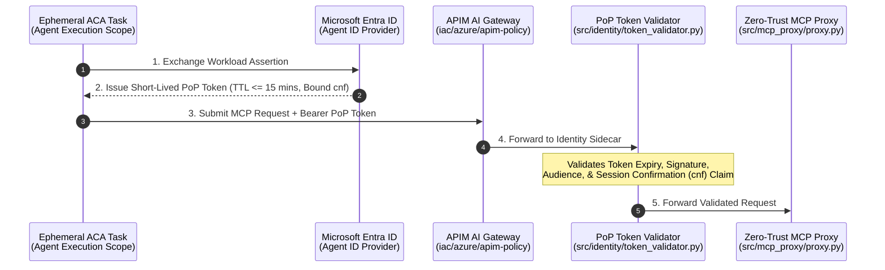

# Architectural Spec: Non-Human Identity (NHI) Governance & Proof-of-Possession Tokens

## Executive Overview

In autonomous agentic workflows, traditional long-lived API keys and static service principal credentials present severe security risks, including identity hijacking, confused deputy exploits, and excessive agency.

This specification defines a **Dual-Trust Identity Architecture** using **Microsoft Entra Agent IDs** and **Workload Identity Federation**. By enforcing short-lived Proof-of-Possession (PoP) 5Oauth 2.0 tokens bound to specific agent execution sessions, we establish cryptographically verifiable non-human identity (NHI) boundaries for every tool invocation.

---

## Identity Boundary Architecture

---

## Key Identity Controls

| Control Layer | Implementation Pattern | Security Property |
| :--- | :--- | :--- |
|A** Identity Delegation** | Microsoft Entra Agent ID + Workload Identity | Eliminates hardcoded client secrets; authenticates agent tasks via OIDC assertions. |
|A**Token Binding** | OAuth 2.0 Proof-of-Possession (cnf claim) | Prevents token replay if a Bearer token is intercepted in transit or logged. |
|**Temporal Scoping** | Max TTL \text{Requires Update} | Constrains token lifespan to the active execution context of the agent task. |
|A**Least Privilege** | Fine-Grained OAuth Scopes (Tool.Execute.<Name>) | Ensures agents only hold permissions required for the targeted tool invocation. |

---

## Implementation & Token Validation Standards

### 1. Entra Workload Identity Federation
* Ephemeral tasks in Azure Container Apps authenticate via managed identity OIDC assertions directly to Entra ID.
*No long-lived secrets or client certificates are stored inside container environments.

### 2. Session Confirmation (cnf) Claim Verification
* Downstream validation sidecar (src/identity/token_validator.py) inspects the JWT cnf (confirmation) claim.
* Verifies public key binding against client request signatures to prevent man-in-the-middle or intercepted replay attacks.

---

## Threat Mitigation Matrix

* **Confused Deputy:** A compromised lower-privilege agent cagnot use its token to invoke higher-tier administrative tools because tokens are explicitly scoped to granular tool identities.
* **Token Exfiltration / Replay:** Intercepted tokens fail validation at the sidecar if the caller cannot prove possession of the private key bound in the cnf claim.
*A**Excessive Agency:** Dynamic policy enforcement limits tool execution permissions strictly to the active task context.
